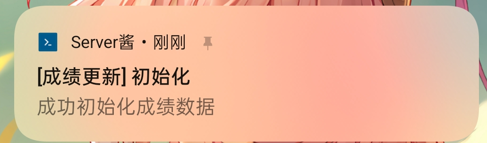

# 北京大学成绩自动查询（server酱版）

苦于安卓没有bark,故在A神基础上改为了server酱版,支持安卓和ios。

## 功能

-   🚀 全自动过门户验证，查询成绩更新
-   ⏰ 每 10 分钟查询一次成绩，再无需手动刷半天
-   📢 server酱通知，让你随时随地知道自己考咋样 ~~寄了没、老师调没调~~

> [!WARNING]
> 更新：由于 [这篇文章](https://www.sivamuthukumar.com/blog/ghactions-scheduled-workflows-external-trigger) 中指出的 GitHub Actions 并不会保证 schedule 调度的准确性，所以本分支采用通过GAS(Google Apps Script)设置外部触发器的形式。

## 简要上手教程

首先，随便新开一个 **私有** 仓库（除非你想让所有人都能看到你的成绩，否则别设为公开）。

然后，按照如下流程设置环境变量：

1. 您需要生成一个 [个人 API 令牌](https://github.com/settings/tokens/new)，然后在仓库的 `Settings -> Secrets and variables -> Actions -> Secrets -> Repository secrets` 中添加如下变量：
    - `API_TOKEN`：个人 GitHub API 令牌
    - `USERNAME`：学号
    - `PASSWORD`：密码
    - `SENDKEY`：server酱令牌，用于通知成绩更新，请参见 [server酱3官网](https://sc3.ft07.com/)，手机应用可以直接到应用商城里下，记得开启通知权限
2. 请注意，由于需要提交更新后的成绩数据到你的仓库，你还需要在 `Settings -> Actions -> General -> Actions permissions -> Workflow permissions` 中启用 `Read and write permissions` 权限。

最后，在仓库中创建 `.github/workflows/watcher.yml` 文件，内容如下（以每 10 分钟查询一次为例）：

```yml
name: pku-grade-watcher

on:
    push:
        branches:
            - main
    workflow_dispatch:

jobs:
    watcher:
        runs-on: ubuntu-latest
        steps:
            - name: pku-grade-watcher
              uses: Zhaoyi-Tian/pku-grade-watcher@v1.0.0 //临时，已向A神提交PR，后续可替换
              with:
                  api-token: ${{ secrets.API_TOKEN }}
                  username: ${{ secrets.USERNAME }}
                  password: ${{ secrets.PASSWORD }}
                  sendkey: ${{ secrets.SENDKEY }}
                  git-name: Github Action
                  git-email: actions@users.noreply.github.com
                  git-message: 'chore(updates): updated data'
```

在成功设置好后，你应当能接收到一条初始化通知：



### GAS(Google Apps Script)外部触发器（需要有google账号）

进入 [Google Apps Script](https://script.google.com/home) ，新建一个项目，复制以下代码：

```javascript
/**
 * @fileoverview PKU-Grade-Watcher Trigger Script
 * @author Zhaoyi-Tian
 * @license GNU GPL v3
 * @see https://github.com/Zhaoyi-Tian/Watch-Grade
 * * Copyright (C) 2026 Zhaoyi-Tian
 * This program is free software: you can redistribute it and/or modify
 * it under the terms of the GNU General Public License as published by
 * the Free Software Foundation, either version 3 of the License.
 */

function triggerGithubAction() {
  // 1. 首先在页面最左侧齿轮图标（项目设置）设置脚本属性，属性为GITHUB_TOKEN，值为你github的一个具有 repo 权限的 Personal Access Token (PAT)。
  const scriptProperties = PropertiesService.getScriptProperties();
  const githubToken = scriptProperties.getProperty('GITHUB_TOKEN');

    // 2. 修改下面的 URL，替换为你自己的私有仓库地址
    // 如https://api.github.com/repos/Zhaoyi-Tian/Watch-Grade/actions/workflows/watcher.yml/dispatches
  const url = "https://api.github.com/repos/你的用户名/你用来查分的私有仓库名/dispatches";
  

  const payload = {
    "ref": "main" // 或者你的默认分支名
  };

  const options = {
    "method": "post",
    "headers": {
      "Authorization": "Bearer " + githubToken,
      "Accept": "application/vnd.github.v3+json",
      "Content-Type": "application/json",
      "User-Agent": "Google-Apps-Script"
    },
    "payload": JSON.stringify(payload),
    "muteHttpExceptions": true
  };

  const response = UrlFetchApp.fetch(url, options);
  
  Logger.log("Status Code: " + response.getResponseCode());
  Logger.log("Response: " + response.getContentText());
}
```
接下来在页面最左侧齿轮图标（项目设置）设置脚本属性，属性为GITHUB_TOKEN，值为你github的一个具有 repo 权限的 Personal Access Token (PAT)。

保存脚本后就可以尝试运行了，返回Status Code: 204，可以到你的私有仓库的 Actions 页面查看是否触发成功。

第一次运行或设置触发器时，会弹出授权窗口。请依次点击：高级 (Advanced) -> 转到 （你的项目名）（不安全） -> 允许。

然后点击左侧的“闹钟”图标（触发器），添加一个触发器，选择 `triggerGithubAction` 函数，选择时间驱动，分钟定时器，然后选择你想要的频率（建议10~20分钟）。

## 免责说明

1. 本项目仅提供自动查询成绩功能，节省同学时间。
2. 因网络环境问题，不保证查询成功。
3. 仅供学习交流使用，**别设置太快的查询频率人造 DDoS 导致被封号**。
4. 实际建议查询频率在 10~20 分钟左右。因为 GitHub Actions 免费版限制了每个工作流最多运行 35 天，而单次运行需要 30s 左右，所以：
    - 10 分钟的频率间隔总共可以运行约 700 天。
    - 15 分钟的频率间隔总共可以运行约 1050 天。
    - 20 分钟的频率间隔总共可以运行约 1400 天。
